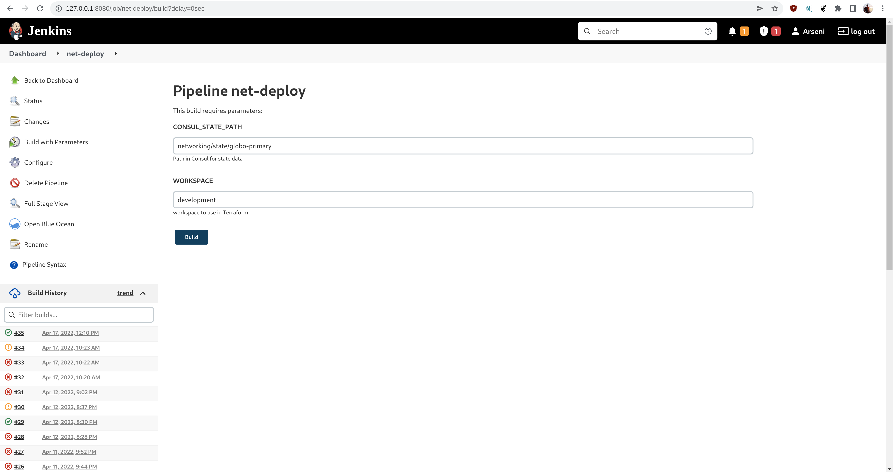

# Jenkins + Terraform + Consul
Use **Jenkins** with **Terraform** for automation and **Consul** as backend service (KV store) for **state**
and **configuration** files management (**base**, **applications** and **networking** stacks).
> Be informed that resources creation in AWS is not free, do not forget to destroy it when you're done.

## Requirements ##
* AWS account
* AWS CLI
* Consul (~>1.11)
* Docker (~>20.10)
* Terraform (~>1.1)
* Unix

## Prerequisites ##

### Terraform configuration ###
1. Configure an AWS profile with proper credentials (**us-east-1** region, admin access is preferred
   or **full access** to **VPC**, **IAM**, **AWSNetworkManager**, **EC2**, **S3**, **RDS**,
   **AmazonSSM** and other resources):
   ```bash
   aws configure --profile deep-dive
   export AWS_PROFILE=deep-dive
   ```
2. Deploy the current environment:
   ```bash
   terraform init
   terraform validate
   terraform plan -out base.tfplan
   terraform apply "base.tfplan"
   ```
3. View all the **Terraform** resources:
   ```bash
   terraform state list
   ```
4. Look at a specific resource:
   ```bash
   terraform state show "module.vpc.aws_vpc.this[0]"
   ```
5. View all the **state** data:
   ```bash
   terraform state pull
   ```
6. Destroy the **current** environment (optional):
   ```bash
   terraform destroy -auto-approve
   ```

### Consul setup and configuration ###
1. Download and install **Consul** executable from https://www.consul.io/downloads
2. Go to the **consul** directory:
   ```bash
   cd consul
   ```
3. Create a **data** directory:
   ```bash
   mkdir data
   ```
4. Launch **Consul** server instance:
   ```bash
   consul agent -bootstrap -config-file="config/consul-config.hcl" -bind="127.0.0.1"
   ```
5. Open a separate terminal window and generate **bootstrap token** (make a note of the root **SecretID** for later):
   ```bash
   consul acl bootstrap
   ```
6. Check **Consul** UI (user **root** token for authentication):
   ```bash
   http://127.0.0.1:8500/ui/dc1/services
   ```
   
7. Set **CONSUL_HTTP_TOKEN** to the root **SecretID**:
    ```bash
    export CONSUL_HTTP_TOKEN=SECRETID_VALUE
    ```
8. Configure **Consul** using **Terraform** (set up paths, policies, and user tokens):
    ```bash
    terraform init
    terraform plan -out consul.tfplan
    terraform apply consul.tfplan  # make a note of `SecretID's` from the output for later
    ```
9. Get token values for **Mary** and **Sally** (make note of **SecretID's** for later):
    ```bash
    consul acl token read -id "ACCESSOR_ID_MARY"
    consul acl token read -id "ACCESSOR_ID_SALLY"
    ```
    http://127.0.0.1:8500/ui/dc1/acls/tokens
    
10. Go back to the main directory:
    ```bash
    cd ..
    ```
11. Set the **Consul** token to **Mary** (replace SECRETID_VALUE with **Mary** secret ID):
    ```bash
    export CONSUL_HTTP_TOKEN=SECRETID_VALUE
    ```
12. Copy consul **backend.tf** from **backend_consul** directory:
    ```bash
    cp backend_consul/backend.tf .
    ```
13. Initialize and apply the backend config (enter **yes** to migrate existing state to the new backend):
    ```bash
    export AWS_PROFILE=deep-dive
    terraform init -backend-config="path=networking/state/globo-primary"
    terraform plan -out plan.tfplan
    terraform apply plan.tfplan
    ```
14. Check updated state file from **Consul** UI:
    ```bash
    http://127.0.0.1:8500/ui/dc1/kv/networking/state/globo-primary/edit
    ```
    
15. Add the **networking** stack to **consul**:
    1. Change to **Mary's** token for **Consul**:
       ```bash
       export CONSUL_HTTP_TOKEN=SECRETID_VALUE
       ```
    2. Write the configuration data for **globo-primary** config:
       ```bash
       cd consul/data_configs
       consul kv put networking/configuration/globo-primary/net_info @globo-primary.json
       consul kv put networking/configuration/globo-primary/common_tags @common-tags.json
       ```
    3. Write the **configuration** data for additional **workspaces** config:
       ```bash
       consul kv put networking/configuration/globo-primary/development/net_info @dev-net.json
       consul kv put networking/configuration/globo-primary/qa/net_info @qa-net.json
       consul kv put networking/configuration/globo-primary/production/net_info @prod-net.json
       ```
    4. Create a **development** workspace (can be repeated for **qa** or **production** environment):
       ```bash
       cd ../../networking
       terraform init -backend-config="path=networking/state/globo-primary" -backend-config="address=127.0.0.1:8500"
       terraform workspace new development
       terraform plan -out dev.tfplan
       terraform apply "dev.tfplan"
       ```
       
       
16. Add the **applications** stack to **consul**:
    1. Change to **Sally's** token for **Consul**:
       ```bash
       export CONSUL_HTTP_TOKEN=SECRETID_VALUE
       ```
    2. Write the **configuration** data for additional **workspaces** config:
       ```bash
       cd ../consul/data_configs
       consul kv put applications/configuration/globo-primary/development/app_info @dev-app.json
       consul kv put applications/configuration/globo-primary/qa/app_info @qa-app.json
       consul kv put applications/configuration/globo-primary/production/app_info @prod-app.json
       consul kv put applications/configuration/globo-primary/common_tags @app-tags.json
       ```
       
       
    3. Create a **development** workspace (can be repeated for **qa** or **production** environment):
       ```bash
       cd ../../applications
       terraform init -backend-config="path=applications/state/globo-primary" -backend-config="address=127.0.0.1:8500"
       terraform workspace new development
       terraform plan -out dev.tfplan
       terraform apply "dev.tfplan"
       ```
       
       
    4. Open web app page:
       1. Go to **AWS** management console:
          ```bash
          https://us-east-1.console.aws.amazon.com/ec2/v2/home?region=us-east-1#Instances
          ```
       2. Open one of the available instances
       3. Find and copy **public IPv4 Address**
       
       4. Paste the link into the browser tab and change **https://** to **http://** (you should be redirected to **wordpress admin** menu):
       
17. Destroy **stacks**:
    * For **base environment** (repo root):
      ```bash
      cd ../
      terraform destroy -auto-approve
      ```
    * For **applications**:
      ```bash
      cd applications
      terraform destroy -auto-approve
      # terraform workspace select development && terraform destroy -auto-approve
      # terraform workspace select qa && terraform destroy -auto-approve
      # terraform workspace select production && terraform destroy -auto-approve
      ```
    * For **networking**:
      ```bash
      cd ../networking
      terraform destroy -auto-approve
      # terraform workspace select development && terraform destroy -auto-approve
      # terraform workspace select qa && terraform destroy -auto-approve
      # terraform workspace select production && terraform destroy -auto-approve
        ```

### Jenkins configuration ###
1. Make sure that **Consul** is still up-and-running
2. Export **root** token:
   ```bash
   export CONSUL_HTTP_TOKEN=SECRETID_VALUE
   ```
3. Create two tokens for **Jenkins** (**networking** and **applications** and make note of `SecretID` for later):
   ```bash
   consul acl token create -policy-name=networking -description="Jenkins networking"
   consul acl token create -policy-name=applications -description="Jenkins applications"
   ```
   http://127.0.0.1:8500/ui/dc1/acls/tokens
   
4. Create a **Jenkins** container (copy the **admin** password):
   ```bash
   # enable traffic routing to 127.0.0.0/8 for `docker0` interface, ssl can use `localhost` as destination: https://www.kernel.org/doc/Documentation/networking/ip-sysctl.txt
   sudo sysctl -w net.ipv4.conf.docker0.route_localnet=1
   # add routing rule to forward port 8080 from 127.0.0.1 to the external `docker0` interface (`Consul` instance on `localhost` will be available from a `Jenkins` container)
   sudo iptables -t nat -A PREROUTING -p tcp -i docker0 --dport 8500 -j DNAT --to-destination 127.0.0.1:8500
   docker pull jenkins/jenkins:lts
   docker run --add-host=host.docker.internal:host-gateway -p 8080:8080 -p 50000:50000 -d -v jenkins_home:/var/jenkins_home --name jenkins jenkins/jenkins:lts
   docker logs jenkins
   ```
5. Go to the http://127.0.0.1:8080 use the **admin** password for logging:
    1. **Terraform** configuration:
       ```markdown
       * Install suggested plugins
       * Create a user
       * Manage jenkins
       * Manage plugins
       * Search for Terraform in Available and install without restart
       * Back to Manage jenkins
       * Global Tool Configuration
       * Add Terraform
       * Name: terraform
       * Install automatically
       * Version - latest for linux (amd64)
       * Click Save
       ```
       
    2. Create **credentials**:
       ```markdown
       * Go to credentials -> global
       * Create a credential of type **secret** text with ID **networking_consul_token** and the consul token as the secret
       * Create a credential of type **secret** text with ID **applications_consul_token** and the consul token as the secret
       * Create a credential of type **secret** text with ID **aws_access_key** and the access key as the secret
       * Create a credential of type **secret** text with ID **aws_secret_access_key** and the access secret as the secret
       ```
       
    3. Create a pipeline for **networking** stack:
       ```markdown
       * Create a new item
       * Name: net-deploy
       * Type pipeline
       * Select poll SCM
       * Definition: Pipeline script from SCM
       * SCM: Git
       * Repo URL: https://github.com/ArseniD/terraform_jenkins_consul.git
       * Script path: networking/Jenkinsfile
       * Click Save
       * Now we can run a build of the network pipeline
       * First build might fail, but now the parameters will be Available
       * Run a new build WITH parameters
       ```
       
       
       
       
    4. Create a pipeline for **application** stack:
       ```markdown
       * Create a new item
       * Name: app-deploy
       * Type pipeline
       * Select poll SCM
       * Definition: Pipeline script from SCM
       * SCM: Git
       * Repo URL: https://github.com/ArseniD/terraform_jenkins_consul.git
       * Script path: applications/Jenkinsfile
       * Click Save
       * Now we can run a build of the application pipeline
       * First build might fail, but now the parameters will be available
       * Run a new build WITH parameters
       ```
       
       
       
       
    5. Open web app page:
       1. Go to **AWS** management console:
          ```bash
          https://us-east-1.console.aws.amazon.com/ec2/v2/home?region=us-east-1#Instances
          ```
       2. Open one of the available instances
       3. Find and copy **public IPv4 Address**
       
       4. Paste the link into the browser tab and change **https://** to **http://** (you should be redirected to **wordpress admin** menu):
          
6. Delete **applications** and **networking** stacks consequently:
    1. Run **app-deploy** and **net-deploy** pipelines with parameters (**development**/**qa**/**production**)
    
    2. Choose **Abort** at the last stage and wait till builds are finished (it takes time as should destroy all relevant resources in **AWS**)
    
    
    3. Check **active**/**deleted** resources from **AWS management console**:
        1. https://us-east-1.console.aws.amazon.com/vpc/home?region=us-east-1#
        
        2. https://us-east-1.console.aws.amazon.com/ec2/v2/home?region=us-east-1#Home:
        
